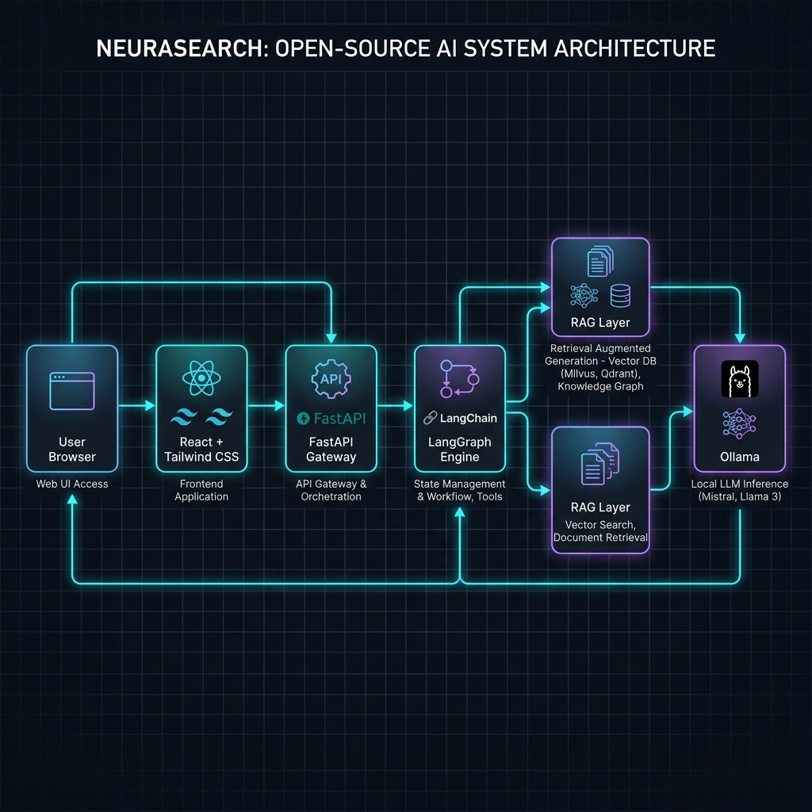
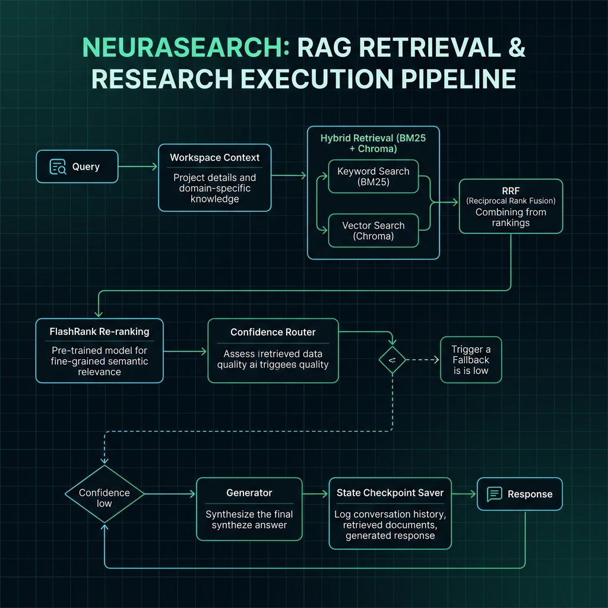

# NeuraSearch

A self-correcting, enterprise-ready AI Research Assistant that runs 100% locally. 

NeuraSearch combines an advanced agentic Corrective RAG (CRAG) graph with a multi-step Deep Research engine to analyze documents, plan search strategies, compile findings, execute sandboxed calculations, and generate high-fidelity reports with local verification.

---

## 🔄 System Architecture

NeuraSearch's execution flow operates at two distinct granularities: the overall system layers and the detailed RAG/research execution pipeline.

### 1. High-Level System Architecture
This diagram outlines the layers of the application from user interface down to local model execution and data stores.



### 2. Detailed RAG & Research Execution Pipeline
This diagram traces a query through workspace context boundaries, hybrid retrieval,Reciprocal Rank Fusion, grading, query re-writing, and sandboxed execution before generating the final report.



---

## 🔥 Key Architectural Features

- **Multi-Workspace Isolation**: Complete logical data boundaries across all tables, ChromaDB collections, and BM25 indices. Context is dynamically resolved via the client's `X-Workspace-ID` header.
- **Deep Research Engine**: Decomposes complex user inquiries into structured search sub-query blueprints, executing retrievals concurrently under a configurable semaphore to maximize local performance.
- **Hybrid Retrieval & RRF Fusion**: Combines dense vector search (`nomic-embed-text` embeddings) and pickle-persisted `rank-bm25` sparse indexing, synthesizing results via Reciprocal Rank Fusion (RRF).
- **Corrective RAG (CRAG) Grader**: Evaluates retrieved document relevance in parallel using Llama 3.1. Routes to query re-writing on partial relevance or Tavily web search fallback on poor relevance.
- **Sandboxed Python Computation**: A highly-restricted sandbox tool executing code in clean subprocesses with blocked network sockets (`env={}`), limited imports (`math`, `datetime`, `json`), and a 3.0s timeout limit.
- **Hallucination Prevention**: Verifies generated reports against retrieved evidence. If claims aren't fully grounded, triggers up to 2 context-guided regenerations before returning the report with a warning tag.
- **Local RAGAS Evaluation**: Measures Faithfulness, Answer Relevancy, Context Recall, and Context Precision in real-time, executing local evaluation runs via Llama 3.1.
- **Production-Ready Observability**: Structured JSON logging output to stdout, ready to plug directly into OpenTelemetry, Datadog, or Grafana Loki.
- **Slowapi Rate Limiting**: Built-in IP-based rate limiting (default 60 req/min for general API, 10 req/min for research endpoints) to prepare local deployments for SaaS scaling.

---

## 🛠️ Tech Stack

- **Large Language Model**: Llama 3.1 8B via Ollama (100% local)
- **Embeddings**: `nomic-embed-text` via Ollama (100% local)
- **Agentic Framework**: LangGraph v1.1 StateGraph + SqliteSaver Checkpointer
- **Vector DB**: ChromaDB (isolated metadata filter)
- **Sparse Retrieval**: rank-bm25 (pickle-persisted per workspace)
- **Backend API**: FastAPI (Slowapi rate limits, structured JSON logs, JWT authentication)
- **Frontend Dashboard**: Vite + React 18 + TailwindCSS (Dark-mode Glassmorphism design)
- **Evaluation Framework**: RAGAS v0.2.x

---

## 🔌 API Reference

### System & Authentication (Root)
```
POST   /token                → Authenticate user, return JWT access token
GET    /health               → Check Ollama and ChromaDB connectivity status
```

### Version 1 Business APIs (`/api/v1`)
```
GET    /api/v1/workspaces           → List all registered workspaces
POST   /api/v1/workspaces          → Create a new workspace context
POST   /api/v1/ingest              → Upload + parse document (PDF/TXT), chunk, and index
POST   /api/v1/query               → Run 8-node CRAG pipeline, stream progress via SSE
GET    /api/v1/documents           → List all unique source filenames in workspace
DELETE /api/v1/documents/{source}  → Delete document from vectorstore and BM25 index
POST   /api/v1/insights/compare    → Contrast summaries of two documents on a topic
GET    /api/v1/conversations       → Get workspace conversation threads
DELETE /api/v1/conversations/{id}  → Delete a conversation thread
POST   /api/v1/research/blueprint  → Decompose question and generate sub-queries
POST   /api/v1/research/execute    → Run deep research pipeline and stream reports
POST   /api/v1/research            → Single-transaction deep research report stream
GET    /api/v1/research/reports    → List all saved deep research reports
GET    /api/v1/settings            → Fetch system settings (Pro mode toggles)
PUT    /api/v1/settings            → Update system settings
GET    /api/v1/eval/run            → Run local RAGAS evaluation on test set
```

---

## 🚀 Getting Started

### 1. Configure Environment
Copy the example environment file and configure your keys:
```bash
cp .env.example .env
```
*(If you want to use the web search fallback, make sure to insert your `TAVILY_API_KEY`.)*

### 2. Startup with Docker Compose
Start the Ollama server, backend server, and React frontend:
```bash
make docker-up
```

### 3. Pull Local Models
Download the required LLM and Embedding models into Ollama:
```bash
make pull-models
```

### 4. Access the Dashboard
Open your browser and navigate to:
`http://localhost:5173`

---

## 📊 Performance Profiles & Benchmarks

Full performance diagnostics and memory profiles are documented in [docs/benchmarks/README.md](docs/benchmarks/README.md).

| Metric | Latency (CPU Llama 3.1) | Latency (Mocked LLM) | Peak Memory |
| --- | --- | --- | --- |
| Blueprint Generation | **16.8 s** | **< 1 ms** | ~121.4 MB |
| Parallel Retrieval | **134.4 s** | **20.6 ms** | ~121.4 MB |
| Report Synthesis | **153.3 s** | **< 1 ms** | ~121.4 MB |

---

## 📘 Architecture Decision Records (ADRs)

Key architectural choices are formally documented in `docs/adr/`:

1. [ADR-001: Workspace Isolation](docs/adr/ADR-001_Workspace_Isolation.md) — Logical workspace filtering.
2. [ADR-002: Chroma Metadata Filtering](docs/adr/ADR-002_Chroma_Metadata_Filtering.md) — Tagging vectors for workspace boundaries.
3. [ADR-003: BM25 Partitioning](docs/adr/ADR-003_BM25_Partitioning.md) — Storing separate pickles per workspace.
4. [ADR-004: Evidence Package](docs/adr/ADR-004_Evidence_Package.md) — Strongly typed pydantic state transitions.
5. [ADR-005: Model Registry](docs/adr/ADR-005_Model_Registry.md) — Global lazy singletons for local models.
6. [ADR-006: Research Blueprint](docs/adr/ADR-006_Research_Blueprint.md) — Two-stage planning UX.
7. [ADR-007: Computation Tool](docs/adr/ADR-007_Computation_Tool.md) — Restricted subprocess sandbox code execution.

---

## 🤝 Contributing

We welcome contributions! Please review our [Contributing Guidelines](CONTRIBUTING.md) to understand development setup, code formatting standards (Ruff + Black), and the Pull Request pipeline.

---

## 🛡️ Security

For reporting security vulnerabilities and understanding security architecture details, see [SECURITY.md](SECURITY.md).

---

## 📄 License

This project is licensed under the MIT License. See [LICENSE](LICENSE) for details.
