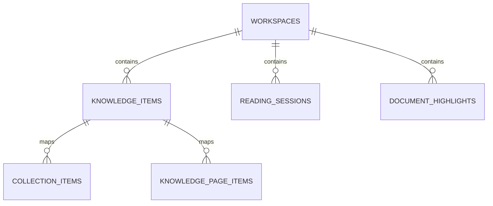

# NeuraSearch — Database Schema

This document details the SQLite database schemas, indices, constraints, and cascading deletions.

---

## 1. Tables Overview

---

## 2. Table Specifications

### workspaces
Stores isolation scopes.
- `id` (TEXT PRIMARY KEY)
- `name` (TEXT NOT NULL)
- `description` (TEXT)
- `created_at` (TEXT NOT NULL)
- `updated_at` (TEXT NOT NULL)

### knowledge_items
Stores persistent notes, pages, and collections.
- `id` (TEXT PRIMARY KEY)
- `workspace_id` (TEXT NOT NULL, FOREIGN KEY REFERENCES workspaces)
- `parent_id` (TEXT, REFERENCES knowledge_items)
- `slug` (TEXT NOT NULL)
- `title` (TEXT NOT NULL)
- `content` (TEXT NOT NULL)
- `summary` (TEXT)
- `type` (TEXT NOT NULL) — `note`, `page`, `collection`
- `status` (TEXT NOT NULL DEFAULT 'active')
- `version` (INTEGER DEFAULT 1)
- `is_pinned` (INTEGER DEFAULT 0)
- `color` (TEXT)
- `icon` (TEXT)
- `created_from` (TEXT NOT NULL)
- `metadata` (TEXT)
- `created_at` (TEXT NOT NULL)
- `updated_at` (TEXT NOT NULL)

### collection_items
Associative table mapping notes/items into collections.
- `collection_id` (TEXT NOT NULL, FOREIGN KEY REFERENCES knowledge_items ON DELETE CASCADE)
- `item_id` (TEXT NOT NULL, FOREIGN KEY REFERENCES knowledge_items ON DELETE CASCADE)
- `position` (INTEGER NOT NULL DEFAULT 0)
- PRIMARY KEY (`collection_id`, `item_id`)

### knowledge_page_items
Associative table mapping notes into pages.
- `page_id` (TEXT NOT NULL, FOREIGN KEY REFERENCES knowledge_items ON DELETE CASCADE)
- `item_id` (TEXT NOT NULL, FOREIGN KEY REFERENCES knowledge_items ON DELETE CASCADE)
- `position` (INTEGER NOT NULL DEFAULT 0)
- PRIMARY KEY (`page_id`, `item_id`)

### document_highlights
- `id` (TEXT PRIMARY KEY)
- `workspace_id` (TEXT NOT NULL, REFERENCES workspaces)
- `document_id` (TEXT NOT NULL)
- `page_number` (INTEGER NOT NULL)
- `highlight_text` (TEXT NOT NULL)
- `coordinates_json` (TEXT)
- `created_at` (TEXT NOT NULL)

---

## 3. Database Indexes

Every table querying on workspace containment includes a dedicated index:
- `idx_workspaces_id`
- `idx_knowledge_items_workspace`
- `idx_reading_sessions_workspace`
- `idx_document_highlights_workspace`
