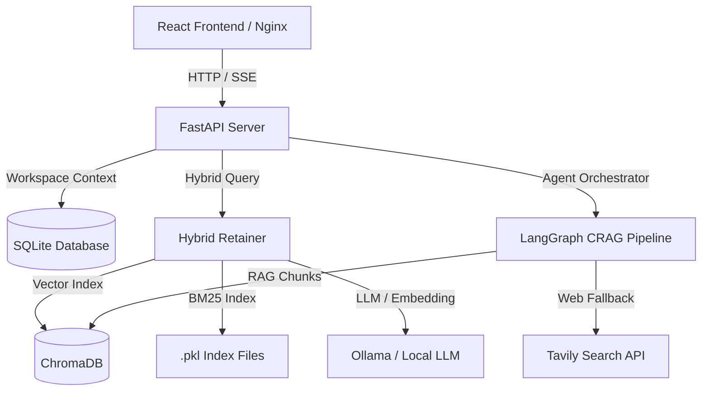

# NeuraSearch — System Architecture

This document details the high-level system architecture, components division, and data flow of the NeuraSearch platform.

---

## 1. System Overview

NeuraSearch is built as a modular AI-powered Knowledge Operating System, separating concerns between frontend presentation, backend routing, vector search ingestion, agentic research, and persistent storage layers:

---

## 2. Component Directory

### Workspace Foundation
Enforces tenant partition isolation using `WorkspaceContext` injection across all services. Ensures data is never leaked between workspaces.

### Research Engine (CRAG Graph)
Powered by a LangGraph StateGraph containing:
- **HyDE Node**: Generates hypothetical ideal answers to expand retrieval quality.
- **Hybrid Search**: Parallel ChromaDB vector retrieval and local BM25 keyword matching fused via Reciprocal Rank Fusion (RRF).
- **Doc Grader**: Grades retrieve relevance in parallel to filter out noise.
- **Query Rewriter**: Context-aware query expansions.
- **Web Search**: Fallback Tavily web search when local context relevance is low.
- **Generator**: Synthesizes and cites final answers.
- **Hallucination Grader**: Iterative loop correcting claims not grounded in source chunks.

### Knowledge Hub & AI Notes
Stores persistent, user-edited notes, pages, and reference collections inside SQLite databases.

### Reading Workspace
Loads session coordinates, caches chunk mapping lists, provides non-LLM substring page search, and supports highlight coordinates saving.
